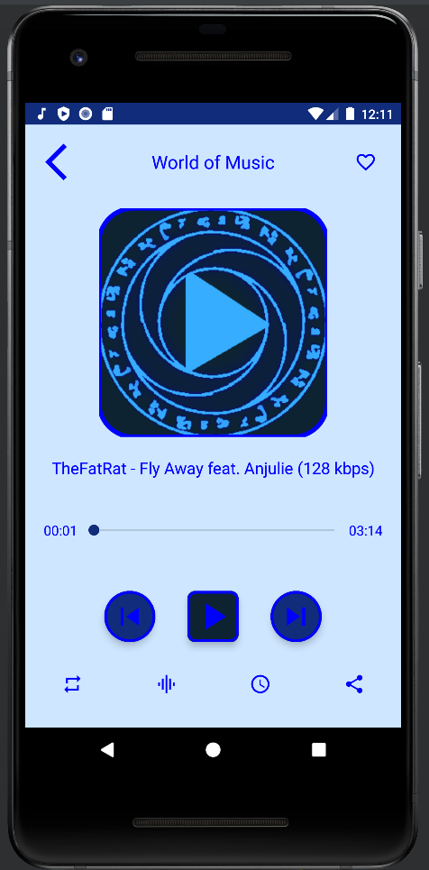
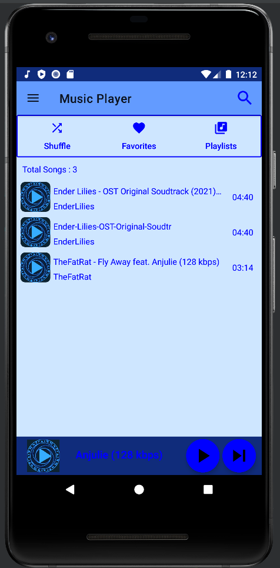

# MusicPlayerApp

An simple music application that load music from your audio files and play it in Android mobile.

  
  

### Some features:
- Play/Pause Audio
- Search Musics
- Play Next Feature
- Custom Theme (Chose theme in Settings)
- Add songs to Favorites
- Create & Add Album Playlists
- Set Timer Playing
- Audio Booster
- Built-in System Equalizer
- Swipe to refresh UI
- Background Playing with custom Notification
- Android Notification with Seekbar
- Save the Data for the audio files 
- Share audio files to others media
- Feedback send directly to email
- Never see ads even while online
- And more updates in the future
  

[demo_vid.webm](https://github.com/Viet281101/MusicPlayerVirap/assets/77735678/9bffe5b7-6ba3-46ca-bedf-9a8ec5d2886a)
